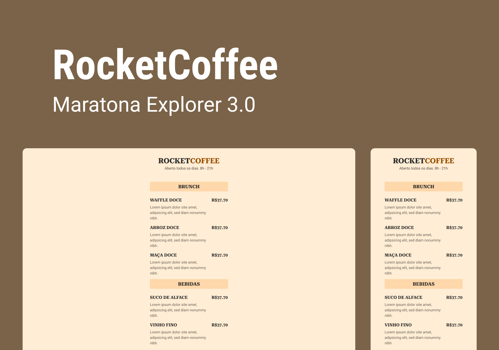

<h1 align="center">
  
</h1>

# RocketCoffee

O projeto é um cardápio responsivo.

## Maratona Explorer 3.0

- [x] Aula 1 (07/08/2022)
- [x] Aula 2 (08/08/2022)
- [ ] Aula 3 (09/08/2022)
- [ ] Encerramento

### Conteúdo da aula 1

- Fundamentos da programação

  Programação é ensinar o computador através de um conjunto de regras para se obter um determinado objetivo.

- Front-End e Back-End

  - Imagina a farmácia onde você vai pedir um remédio para o atendente:

    O cliente seria o navegador (browser) que possui a parte gráfica para interagir com o usuário.

    O servidor é um computador em algum lugar do mundo que tem os códigos sobre as informações protegidas, íntegras e disponíveis quando necessário.

    O cliente é responsável por fazer o pedido, enquanto o servidor é o responsável por escutar e responder ao pedido.

    O cliente é o front-end e o servidor é o back-end

  - Tecnologias Front-End: HTML, CSS e JavaScript
  - Tecnologias Back-End: NodeJS, SQL.

- HTML
  Significa Hypertext Markup Language ou linguagem de marcação de texto para estruturar textos, criar links, imagens, vídeos, etc.

- Código Final
  Construímos a primeira parte do projeto usando os elementos HTML.

### Conteúdo da aula 2

- CSS
  Significa Cascading Style Sheets ou folha de estilo em cascata.

  É responsável pela apresentação visual.

- Declaração
  São pedaços de código que ditam as propriedades e valores a serem aplicadas a um elemento HTML.

- Cascata
  Quando há 2 ou mais declarações, a última será mais relevante.
  A cascata perde prioridade, dando lugar à especificidade.

- Seletores
  Eles definem quais elementos um conjunto de regras CSS se aplica.
  Os elementos podem ser baseados por classe, id, nome por tag, etc.

- Especificidade
  Cada seletor tem um peso e a soma dos pesos será levada em conta para que determinada declaração seja mais específica.

- Box Model
  Baseado na abstração de que tudo são caixas.

  Os elementos HTML serão considerados como caixas e possuirão propriedades como largura, altura, borda, preenchimento (espaço interno), espaçamento (espaço externo) e conteúdo.

## Link para o Projeto

[Figma](https://www.figma.com/community/file/1138209866997102496)
